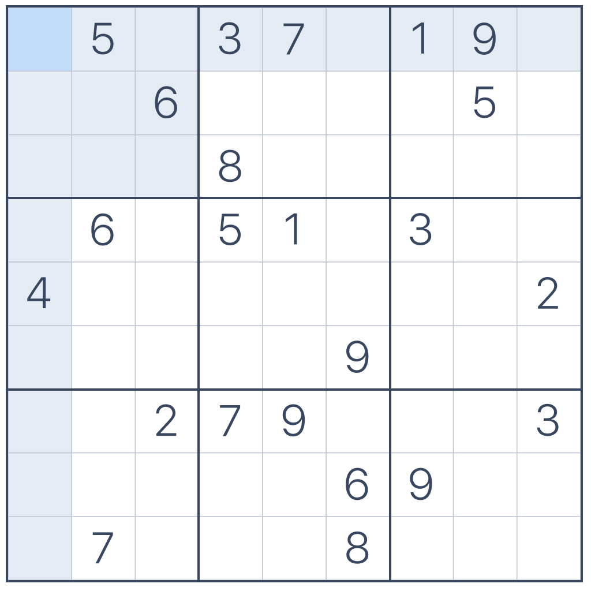
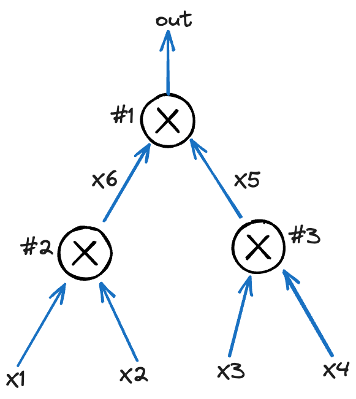
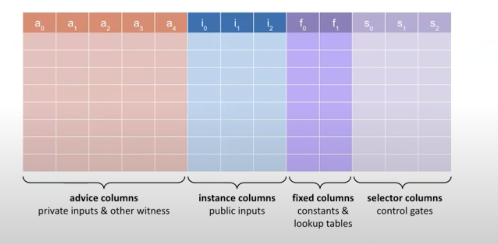

# How Halo2 works at the code level

Here I will combine the [example in the Halo2 book](https://zcash.github.io/halo2/user/simple-example.html) to introduce how Halo2 works and how to use Halo2.

If you haven't touched ZK before, don't worry, I will introduce enough background knowledge. 

## Start with some simple examples

**Actors**

- Prover - I will call her Alice
- Verifier - I will call him Bob

**Sudoku**

In order to establish some basic understanding, I use the example of Sudoku.

This is Sudoku problem, its answer needs to fill in the blank cell with an integer from 1-9, and satisfy that each `row`, `column` and `small table` contains 1-9.



The prover Alice says she knows the answer of a certain Sudoku, and Bob will verify it.

1. Bob generates random numbers $x, y$, that $x \in \{ 1, 2, 3 \}$ and $y \in \{1, \dots, 9\}$, $x$ represents type in `row`, `column` and `small table`, and send to Alice.
2. For example, this time $x = 1, y = 5$, then Alice needs to provide 9 values of row_5 to Bob
3. Bob will check if the set of 9 values is equal to $\{1, \dots, 9\}$

Repeat step 1-3, And Bob rebuild Sudoku on a blank $9 \times 9$ table to check if Alice's answer is inconsistent.

As the rounds progress, Alice always passes the check. There is an increasing **probability** that Alice does have the answer. At the same time, Alice leaks more and more knowledge about the answer.

It is not **zero-knowledge** because Bob has at least part of the answer's knowledge.

This is an **interactive proof**, which has some disadvantages. It requires the prover and the verifier to be online at the same time, and the scalability is poor, because if Alice needs to prove to Dan, Eva, etc. that she knows the answer, she can only repeat the same progress.

Verifiers need to generate **random** numbers, just like verifiers in real life - market product quality inspectors. They need to **randomly** check certain products from a group of products. If the product seller decides which products to check, the seller will definitely choose products which are good.

**Equal Polynomial**

Another example concerns polynomials. 

Suppose there is a mathematical problem whose answer is a polynomial $f(x) = \sum_{i=0}^{k}c_ix^i$. Bob already knows the answer, that is, knows the polynomial, and Alice claims that she also knows the answer, whose polynomial is $g(x) = \sum_{i=0}^{k}d_ix^i$, and Alice proves this to Bob.

In the first method, Alice sends all $d_i$ to Bob. Bob checks if $d_i = c_i$, and here $k$ comparisons are required.

In the second method, 
1. Bob **randomly** selects a value $r$ from the domain of $g(x)$ and sends it to Alice.
2. Alice calculates the value of $g(r)$, and send to Bob.
3. Bob calculates the value of $f(r)$, and checks if $g(r) = f(r)$

If $g(r) = f(r)$, then the probability that Alice is lying, that is, the probability that $P_{g(x) != f(x)} \leqslant \frac{k}{|domain|}$,  where $|demain|$ represents the number of elements in the domain of $g(x), f(x)$.

Because this equation $f(x) - g(x) = \sum_{i=0}^{k}(c_i-d_i)x^i = 0$
 has at most $k$ roots. The probability that $r$ randomly selected from the domain is exactly one of the $k$ roots is $\frac{k}{|domain|}$

The length of the general domain is very large, about $2^{256}$, $k$ is [about $2^{20} \sim 2^{30}$](https://crypto.stackexchange.com/a/103416/75873), Therefore the probability of Alice lying is negligibly small。

The second method reduces the number of comparisons from $k$ to $1$. This is where the **Succinct** comes from in a sense.

And it is **zero-knowledge**, because Alice did not reveal the information of $d_i$.

We can replace the interactive steps with a **non-interactive random oracle** access. In practice, we can use a cryptographic hash function instead. This is why we need to [hash the message when signing](https://en.wikipedia.org/wiki/Fiat%E2%80%93Shamir_heuristic)

Through the above two examples, we have a rough understanding of **zk-SNARK**(Zero Knowledge Succinct Non-Interactive Argument of Knowledge).

> IPs and **Arguments** are cryptographic protocols that enable an **untrusted** prover to provide a guarantee that it performed a requested computation **corrently**.
> 
> **Succinct** means that the proofs are short. **Non-interactive** means that the proof is static, consisting of a single message from the prover. **Of Knowledge** roughly means that the protocol establishes not only that a statement is true, but also that the prover knows a **witness** to the veracity of the statement.


## Halo2 examples

How to prove that $2^2 \times 3^2 = 36$ ?

### PLONKish Arithmetization

**program**

$$(a*b)^2 = c$$

```rs
fn cal(a: u64, b: u64) -> u64 {
    (a * b).pow(2)
}
```

There are many ways to convert the same program to a circuit, and different circuits will have different performances. For circuit optimization, please refer to [here](https://zips.z.cash/protocol/canopy.pdf#circuitdesign).

**circuit**



It can be seen that this circuit is composed of three multiplication gates, and satisfies three constraints:

- $x_1 \cdot x_2 =x_6$
- $x_3 \cdot x_4 = x_5$
- $x_6 \cdot x_5 = out$

We define a matrix $W\in\mathbb{F}^{n\times 3}$ to represent constraints ($n$ being the number of arithmetic gates):

$$
\begin{array}{c|c|c|c|}
\texttt{i} & w_a & w_b & w_c  \\
\hline
\texttt{1} & x_6 & x_5 & out \\
\texttt{2} & x_1 & x_2 & x_6 \\
\texttt{3} & x_3 & x_4 & x_5 \\
\end{array}
$$

The $W$ matrix can only represent the input and output values of the gates. We also need to represent the operation(Add or Mul) of the gates, 
$$
q_L \circ w_a + q_R \circ w_b + q_M\circ(w_a\cdot w_b) + q_C -  q_O\circ w_c = 0
$$


We define a vector $Q\in\mathbb{F}^{n\times5}$:

$$
\begin{array}{c|c|c|c|}
\texttt{i}  & q_L & q_R & q_M & q_C & q_O  \\
\hline
\texttt{1} & 0 & 0 & 1 & 0& 1 \\
\texttt{2} & 1 & 1 & 0 & 0& 1 \\
\texttt{3} & 0 & 0 & 1 & 0& 1 \\
\end{array}
$$

### Halo2 demo



我们定义一个 MyConfig， 

```rs
#[derive(Clone, Copy, Debug, Eq, PartialEq, Hash)]
struct MyConfig {
    advice: [Column<Advice>; 2],
    instance: Column<Instance>,
    s_mul: Selector,
}
```


```rs
impl<F: Field> Circuit<F> for MyCircuit<F> {
    type Config = MyConfig;
    type FloorPlanner = SimpleFloorPlanner;
    fn without_witnesses(&self) -> Self {}

    // 它仅仅用于电路拓扑，和电路里面具体的值没关系
    // 返回的 Config 一般表示不同类型的列各有有多少， 它们的 column index 是多少。
    // 并且修改了约束系统。
    fn configure(meta: &mut ConstraintSystem<F>) -> Self::Config {}

    // 仅仅修改了布局器
    fn synthesize(
        &self,
        config: Self::Config,
        mut layouter: impl Layouter<F>,
    ) -> Result<(), Error> {}
}
```

<details><summary>MockProver</summary>
<p>

```rs
MockProver { 
    k: 4, 
    n: 16, 
    cs: 
        ConstraintSystem { 
            num_fixed_columns: 2, 
            num_advice_columns: 2, 
            num_instance_columns: 1, 
            num_selectors: 1, 
            selector_map: [
                Column { index: 1, column_type: Fixed }
            ], 
            gates: [
                Gate { 
                    name: "mul", 
                    constraint_names: [""], 
                    polys: [
                        Product(
                            Fixed { 
                                query_index: 1, 
                                column_index: 1, 
                                rotation: Rotation(0) 
                            }, 
                            Sum(
                                Product(
                                    Advice { 
                                        query_index: 0, 
                                        column_index: 0, 
                                        rotation: Rotation(0) 
                                    }, 
                                    Advice { 
                                        query_index: 1, 
                                        column_index: 1, 
                                        rotation: Rotation(0) 
                                    }
                                ), 
                                Negated(
                                    Advice { 
                                        query_index: 2, 
                                        column_index: 0, 
                                        rotation: Rotation(1) 
                                    }
                                )
                            )
                        )
                    ], 
                    queried_selectors: [
                        Selector(0, true)
                    ], 
                    queried_cells: [
                        VirtualCell { 
                            column: Column { index: 0, column_type: Advice }, 
                            rotation: Rotation(0) 
                        }, 
                        VirtualCell { 
                            column: Column { index: 1, column_type: Advice }, 
                            rotation: Rotation(0)
                        }, 
                        VirtualCell { 
                            column: Column { index: 0, column_type: Advice }, 
                            rotation: Rotation(1) 
                        }
                    ] 
                }
            ], 
            advice_queries: [
                (Column { index: 0, column_type: Advice }, Rotation(0)), 
                (Column { index: 1, column_type: Advice }, Rotation(0)), 
                (Column { index: 0, column_type: Advice }, Rotation(1))
            ], 
            num_advice_queries: [2, 1], 
            instance_queries: [
                (Column { index: 0, column_type: Instance }, Rotation(0))
            ], 
            fixed_queries: [
                (Column { index: 0, column_type: Fixed }, Rotation(0)), 
                (Column { index: 1, column_type: Fixed }, Rotation(0))
            ], 
            permutation: 
                Argument { 
                    columns: [
                        Column { index: 0, column_type: Instance }, 
                        Column { index: 0, column_type: Fixed }, 
                        Column { index: 0, column_type: Advice }, 
                        Column { index: 1, column_type: Advice }
                    ] 
                }, 
            lookups: [], 
            constants: [
                Column { index: 0, column_type: Fixed }
            ], 
            minimum_degree: None 
        }, 
    regions: [
        Region { 
            name: "load private", 
            columns: {
                Column { index: 0, column_type: Advice }
            }, 
            rows: Some((0, 0)), 
            enabled_selectors: {}, 
            cells: [
                (Column { index: 0, column_type: Advice }, 0)
            ] 
        }, 
        Region { 
            name: "load private", 
            columns: {
                Column { index: 0, column_type: Advice }
            }, 
            rows: Some((1, 1)), 
            enabled_selectors: {}, 
            cells: [
                (Column { index: 0, column_type: Advice }, 1)
            ] 
        }, 
        Region { 
            name: "load constant",
            columns: {
                Column { index: 0, column_type: Advice }
            },
            rows: Some((2, 2)), 
            enabled_selectors: {}, 
            cells: [
                (Column { index: 0, column_type: Advice }, 2)
            ] 
        }, 
        Region { 
            name: "mul", 
            columns: {
                Column { index: 0, column_type: Advice },
                Column { index: 1, column_type: Advice }
            }, 
            rows: Some((3, 4)), 
            enabled_selectors: {
                Selector(0, true): [3]
            }, 
            cells: [
                (Column { index: 0, column_type: Advice }, 3), 
                (Column { index: 1, column_type: Advice }, 3), 
                (Column { index: 0, column_type: Advice }, 4)
            ] 
        }, 
        Region { 
            name: "mul", 
            columns: {
                Column { index: 0, column_type: Advice }, 
                Column { index: 1, column_type: Advice }
            }, 
            rows: Some((5, 6)), 
            enabled_selectors: {
                Selector(0, true): [5]
            }, 
            cells: [
                (Column { index: 0, column_type: Advice }, 5), 
                (Column { index: 1, column_type: Advice }, 5), 
                (Column { index: 0, column_type: Advice }, 6)
            ] 
        }, 
        Region { 
            name: "mul", 
            columns: {
                Column { index: 0, column_type: Advice }, 
                Column { index: 1, column_type: Advice }
            }, 
            rows: Some((7, 8)), 
            enabled_selectors: {
                Selector(0, true): [7]
            }, 
            cells: [
                (Column { index: 0, column_type: Advice }, 7), 
                (Column { index: 1, column_type: Advice }, 7), 
                (Column { index: 0, column_type: Advice }, 8)
            ] 
        }
    ], 
    current_region: None, 
    fixed: [
        [
            Assigned(0x0000000000000000000000000000000000000000000000000000000000000007), 
            Unassigned, 
            Unassigned, 
            Unassigned, 
            Unassigned, 
            Unassigned, 
            Unassigned, 
            Unassigned, 
            Unassigned, 
            Unassigned, 
            Unassigned, 
            Unassigned, 
            Unassigned, 
            Unassigned, 
            Unassigned, 
            Unassigned
        ], 
        [
            Assigned(0x0000000000000000000000000000000000000000000000000000000000000000), 
            Assigned(0x0000000000000000000000000000000000000000000000000000000000000000), 
            Assigned(0x0000000000000000000000000000000000000000000000000000000000000000), 
            Assigned(0x0000000000000000000000000000000000000000000000000000000000000001), 
            Assigned(0x0000000000000000000000000000000000000000000000000000000000000000), 
            Assigned(0x0000000000000000000000000000000000000000000000000000000000000001), 
            Assigned(0x0000000000000000000000000000000000000000000000000000000000000000), 
            Assigned(0x0000000000000000000000000000000000000000000000000000000000000001), 
            Assigned(0x0000000000000000000000000000000000000000000000000000000000000000), 
            Assigned(0x0000000000000000000000000000000000000000000000000000000000000000), 
            Assigned(0x0000000000000000000000000000000000000000000000000000000000000000), 
            Assigned(0x0000000000000000000000000000000000000000000000000000000000000000), 
            Assigned(0x0000000000000000000000000000000000000000000000000000000000000000), 
            Assigned(0x0000000000000000000000000000000000000000000000000000000000000000), 
            Assigned(0x0000000000000000000000000000000000000000000000000000000000000000), 
            Assigned(0x0000000000000000000000000000000000000000000000000000000000000000)
        ]
    ], 
    advice: [
        [
            Assigned(0x0000000000000000000000000000000000000000000000000000000000000002), 
            Assigned(0x0000000000000000000000000000000000000000000000000000000000000003), 
            Assigned(0x0000000000000000000000000000000000000000000000000000000000000007), 
            Assigned(0x0000000000000000000000000000000000000000000000000000000000000002), 
            Assigned(0x0000000000000000000000000000000000000000000000000000000000000006), 
            Assigned(0x0000000000000000000000000000000000000000000000000000000000000006), 
            Assigned(0x0000000000000000000000000000000000000000000000000000000000000024), 
            Assigned(0x0000000000000000000000000000000000000000000000000000000000000007), 
            Assigned(0x00000000000000000000000000000000000000000000000000000000000000fc), 
            Unassigned, 
            Poison(10), 
            Poison(11), 
            Poison(12), 
            Poison(13), 
            Poison(14), 
            Poison(15)
        ], 
        [
            Unassigned, 
            Unassigned, 
            Unassigned, 
            Assigned(0x0000000000000000000000000000000000000000000000000000000000000003), 
            Unassigned, 
            Assigned(0x0000000000000000000000000000000000000000000000000000000000000006), 
            Unassigned, 
            Assigned(0x0000000000000000000000000000000000000000000000000000000000000024), 
            Unassigned, 
            Unassigned, 
            Poison(10), 
            Poison(11), 
            Poison(12), 
            Poison(13), 
            Poison(14), 
            Poison(15)
        ]
    ], 
    instance: [
        [
            Assigned(0x00000000000000000000000000000000000000000000000000000000000000fc), 
            Padding, 
            Padding,
            Padding, 
            Padding, 
            Padding, 
            Padding, 
            Padding, 
            Padding, 
            Padding, 
            Padding, 
            Padding, 
            Padding, 
            Padding, 
            Padding,
            Padding
        ]
    ], 
    selectors: [
        [
            false, 
            false, 
            false, 
            true, 
            false,
            true, 
            false, 
            true, 
            false, 
            false, 
            false, 
            false, 
            false, 
            false, 
            false, 
            false
        ]
    ], 
    permutation: 
        Assembly { 
            columns: [
                Column { index: 0, column_type: Instance }, 
                Column { index: 0, column_type: Fixed },
                Column { index: 0, column_type: Advice }, 
                Column { index: 1, column_type: Advice }
            ], 
            mapping: [
                [
                    (2, 8), 
                    (0, 1), 
                    (0, 2), 
                    (0, 3), 
                    (0, 4), 
                    (0, 5), 
                    (0, 6), 
                    (0, 7), 
                    (0, 8), 
                    (0, 9), 
                    (0, 10), 
                    (0, 11), 
                    (0, 12), 
                    (0, 13), 
                    (0, 14), 
                    (0, 15)
                ], 
                [
                    (2, 2), 
                    (1, 1), 
                    (1, 2), 
                    (1, 3), 
                    (1, 4), 
                    (1, 5), 
                    (1, 6), 
                    (1, 7), 
                    (1, 8), 
                    (1, 9), 
                    (1, 10), 
                    (1, 11), 
                    (1, 12), 
                    (1, 13), 
                    (1, 14), 
                    (1, 15)
                ], 
                [
                    (2, 3), 
                    (3, 3), 
                    (2, 7), 
                    (2, 0), 
                    (3, 5), 
                    (2, 4), 
                    (3, 7), 
                    (1, 0), 
                    (0, 0), 
                    (2, 9), 
                    (2, 10), 
                    (2, 11), 
                    (2, 12), 
                    (2, 13), 
                    (2, 14), 
                    (2, 15)
                ], 
                [
                    (3, 0), 
                    (3, 1), 
                    (3, 2), 
                    (2, 1), 
                    (3, 4), 
                    (2, 5), 
                    (3, 6), 
                    (2, 6), 
                    (3, 8), 
                    (3, 9), 
                    (3, 10), 
                    (3, 11), 
                    (3, 12), 
                    (3, 13), 
                    (3, 14), 
                    (3, 15)
                ]
            ], 
            aux: [
                [
                    (2, 8), 
                    (0, 1), 
                    (0, 2), 
                    (0, 3), 
                    (0, 4), 
                    (0, 5), 
                    (0, 6), 
                    (0, 7), 
                    (0, 8), 
                    (0, 9), 
                    (0, 10), 
                    (0, 11), 
                    (0, 12), 
                    (0, 13), 
                    (0, 14), 
                    (0, 15)
                ], 
                [
                    (1, 0), 
                    (1, 1), 
                    (1, 2), 
                    (1, 3), 
                    (1, 4), 
                    (1, 5), 
                    (1, 6), 
                    (1, 7), 
                    (1, 8), 
                    (1, 9), 
                    (1, 10), 
                    (1, 11), 
                    (1, 12), 
                    (1, 13), 
                    (1, 14), 
                    (1, 15)
                ], 
                [
                    (2, 3), 
                    (3, 3), 
                    (1, 0), 
                    (2, 3), 
                    (2, 5), 
                    (2, 5), 
                    (3, 7), 
                    (1, 0), 
                    (2, 8), 
                    (2, 9), 
                    (2, 10), 
                    (2, 11), 
                    (2, 12), 
                    (2, 13), 
                    (2, 14), 
                    (2, 15)
                ], 
                [
                    (3, 0), 
                    (3, 1), 
                    (3, 2), 
                    (3, 3), 
                    (3, 4), 
                    (2, 5), 
                    (3, 6), 
                    (3, 7), 
                    (3, 8), 
                    (3, 9), 
                    (3, 10), 
                    (3, 11), 
                    (3, 12), 
                    (3, 13), 
                    (3, 14), 
                    (3, 15)
                ]
            ], 
            sizes: [
                [
                    1, 
                    1, 
                    1,
                    1,
                    1, 
                    1, 
                    1, 
                    1, 
                    1, 
                    1, 
                    1, 
                    1, 
                    1, 
                    1, 
                    1, 
                    1
                ],
                [
                    3, 
                    1, 
                    1, 
                    1, 
                    1, 
                    1, 
                    1, 
                    1, 
                    1, 
                    1, 
                    1, 
                    1, 
                    1, 
                    1, 
                    1, 
                    1
                ], 
                [
                    1, 
                    1, 
                    1, 
                    2, 
                    1, 
                    3, 
                    1, 
                    1, 
                    2, 
                    1, 
                    1, 
                    1, 
                    1, 
                    1, 
                    1, 
                    1
                ], 
                [
                    1, 
                    1, 
                    1, 
                    2, 
                    1, 
                    1, 
                    1, 
                    2, 
                    1, 
                    1, 
                    1, 
                    1, 
                    1, 
                    1, 
                    1, 
                    1
                ]
            ] 
        }, 
    usable_rows: 0..10 
}


MockProver { 
    k: 4,
    n: 16,
    cs: ConstraintSystem { 
        num_fixed_columns: 1,
        num_advice_columns: 2,
        num_instance_columns: 1,
        num_selectors: 1,
        selector_map: [],
        gates: [
            Gate { 
                name: "mul",
                constraint_names: [""],
                polys: [
                    Product(
                        Selector(
                            Selector(0,true)
                        ),
                        Sum(
                            Product(
                                Advice { query_index: 0,column_index: 0,rotation: Rotation(0) },
                                Advice { query_index: 1,column_index: 1,rotation: Rotation(0) }
                            ),
                            Negated(
                                Advice { query_index: 2,column_index: 0,rotation: Rotation(1) }
                            )
                        )
                    )
                ],
                queried_selectors: [
                    Selector(0,true)
                ],
                queried_cells: [
                    VirtualCell { column: Column { index: 0,column_type: Advice },rotation: Rotation(0) },
                    VirtualCell { column: Column { index: 1,column_type: Advice },rotation: Rotation(0) },
                    VirtualCell { column: Column { index: 0,column_type: Advice },rotation: Rotation(1) }
                ] 
            }
        ],
        advice_queries: [
            (Column { index: 0,column_type: Advice },Rotation(0)),
            (Column { index: 1,column_type: Advice },Rotation(0)),
            (Column { index: 0,column_type: Advice },Rotation(1))
        ],
        num_advice_queries: [2,1],
        instance_queries: [(Column { index: 0,column_type: Instance },Rotation(0))],
        fixed_queries: [(Column { index: 0,column_type: Fixed },Rotation(0))],
        permutation: Argument { 
            columns: [
                Column { index: 0,column_type: Instance },
                Column { index: 0,column_type: Fixed },
                Column { index: 0,column_type: Advice },
                Column { index: 1,column_type: Advice }
            ] 
        },
        lookups: [],
        constants: [
            Column { index: 0,column_type: Fixed }
        ],
        minimum_degree: None 
    },
    regions: [
        Region { 
            name: "load private",
            columns: {Column { index: 0,column_type: Advice }},
            rows: Some((0,0)),
            enabled_selectors: {},
            cells: [(Column { index: 0,column_type: Advice },0)] 
        },
        Region { 
            name: "load private",
            columns: {Column { index: 0,column_type: Advice }},
            rows: Some((1,1)),
            enabled_selectors: {},
            cells: [(Column { index: 0,column_type: Advice },1)] 
        },
        Region { 
            name: "load constant",
            columns: {Column { index: 0,column_type: Advice }},
            rows: Some((2,2)),
            enabled_selectors: {},
            cells: [(Column { index: 0,column_type: Advice },2)] 
        },
        Region { 
            name: "mul",
            columns: {
                Column { index: 1,column_type: Advice },
                Column { index: 0,column_type: Advice }
            },
            rows: Some((3,4)),
            enabled_selectors: {
                Selector(0,true): [3]
            },
            cells: [
                (Column { index: 0,column_type: Advice },3),
                (Column { index: 1,column_type: Advice },3),
                (Column { index: 0,column_type: Advice },4)
            ] 
        },
        Region { 
            name: "mul",
            columns: {
                Column { index: 0,column_type: Advice },
                Column { index: 1,column_type: Advice }
            },
            rows: Some((5,6)),
            enabled_selectors: {Selector(0,true): [5]},
            cells: [
                (Column { index: 0,column_type: Advice },5),
                (Column { index: 1,column_type: Advice },5),
                (Column { index: 0,column_type: Advice },6)
            ] 
        },
        Region { 
            name: "mul",
            columns: {
                Column { index: 1,column_type: Advice },
                Column { index: 0,column_type: Advice }
            },
            rows: Some((7,8)),
            enabled_selectors: {Selector(0,true): [7]},
            cells: [
                (Column { index: 0,column_type: Advice },7),
                (Column { index: 1,column_type: Advice },7),
                (Column { index: 0,column_type: Advice },8)
            ] 
        }
    ],
    current_region: None,
    fixed: [
        [
            Assigned(0x000000000000000000000000000000000000000000000000000000000000000d),
            Unassigned,
            Unassigned,
            Unassigned,
            Unassigned,
            Unassigned,
            Unassigned,
            Unassigned,
            Unassigned,
            Unassigned,
            Unassigned,
            Unassigned,
            Unassigned,
            Unassigned,
            Unassigned,
            Unassigned
        ]
    ],
    advice: [
        [
            Assigned(0x0000000000000000000000000000000000000000000000000000000000000011),
            Assigned(0x0000000000000000000000000000000000000000000000000000000000000017),
            Assigned(0x000000000000000000000000000000000000000000000000000000000000000d),
            Assigned(0x0000000000000000000000000000000000000000000000000000000000000011),
            Assigned(0x0000000000000000000000000000000000000000000000000000000000000187),
            Assigned(0x0000000000000000000000000000000000000000000000000000000000000187),
            Assigned(0x0000000000000000000000000000000000000000000000000000000000025531),
            Assigned(0x000000000000000000000000000000000000000000000000000000000000000d),
            Assigned(0x00000000000000000000000000000000000000000000000000000000001e537d),
            Unassigned,
            Poison(10),
            Poison(11),
            Poison(12),
            Poison(13),
            Poison(14),
            Poison(15)
        ],
        [
            Unassigned,
            Unassigned,
            Unassigned,
            Assigned(0x0000000000000000000000000000000000000000000000000000000000000017),
            Unassigned,
            Assigned(0x0000000000000000000000000000000000000000000000000000000000000187),
            Unassigned,
            Assigned(0x0000000000000000000000000000000000000000000000000000000000025531),
            Unassigned,
            Unassigned,
            Poison(10),
            Poison(11),
            Poison(12),
            Poison(13),
            Poison(14),
            Poison(15)
        ]
    ],
    instance: [
        [
            Assigned(0x00000000000000000000000000000000000000000000000000000000001e537d), // 1987453 = 13*17*17*23*23
            Padding,
            Padding,
            Padding,
            Padding,
            Padding,
            Padding,
            Padding,
            Padding,
            Padding,
            Padding,
            Padding,
            Padding,
            Padding,
            Padding,
            Padding
        ]
    ],
    selectors: [
        [
            false,
            false,
            false,
            true,
            false,
            true,
            false,
            true,
            false,
            false,
            false,
            false,
            false,
            false,
            false,
            false
        ]
    ],
    permutation: Assembly { 
        columns: [
            Column { index: 0,column_type: Instance },
            Column { index: 0,column_type: Fixed },
            Column { index: 0,column_type: Advice },
            Column { index: 1,column_type: Advice }
        ],
        mapping: [
            [(2, 8), (0, 1), (0, 2), (0, 3), (0, 4), (0, 5), (0, 6), (0, 7), (0, 8), (0, 9), (0, 10), (0, 11), (0, 12), (0, 13), (0, 14), (0, 15)], 
            [(2, 2), (1, 1), (1, 2), (1, 3), (1, 4), (1, 5), (1, 6), (1, 7), (1, 8), (1, 9), (1, 10), (1, 11), (1, 12), (1, 13), (1, 14), (1, 15)], 
            [(2, 3), (3, 3), (2, 7), (2, 0), (3, 5), (2, 4), (3, 7), (1, 0), (0, 0), (2, 9), (2, 10), (2, 11), (2, 12), (2, 13), (2, 14), (2, 15)], 
            [(3, 0), (3, 1), (3, 2), (2, 1), (3, 4), (2, 5), (3, 6), (2, 6), (3, 8), (3, 9), (3, 10), (3, 11), (3, 12), (3, 13), (3, 14), (3, 15)]
        ], 
        aux: [
            [(2, 8), (0, 1), (0, 2), (0, 3), (0, 4), (0, 5), (0, 6), (0, 7), (0, 8), (0, 9), (0, 10), (0, 11), (0, 12), (0, 13), (0, 14), (0, 15)], 
            [(1, 0), (1, 1), (1, 2), (1, 3), (1, 4), (1, 5), (1, 6), (1, 7), (1, 8), (1, 9), (1, 10), (1, 11), (1, 12), (1, 13), (1, 14), (1, 15)], 
            [(2, 3), (3, 3), (1, 0), (2, 3), (2, 5), (2, 5), (3, 7), (1, 0), (2, 8), (2, 9), (2, 10), (2, 11), (2, 12), (2, 13), (2, 14), (2, 15)], 
            [(3, 0), (3, 1), (3, 2), (3, 3), (3, 4), (2, 5), (3, 6), (3, 7), (3, 8), (3, 9), (3, 10), (3, 11), (3, 12), (3, 13), (3, 14), (3, 15)]
        ], 
        sizes: [
            [1, 1, 1, 1, 1, 1, 1, 1, 1, 1, 1, 1, 1, 1, 1, 1], 
            [3, 1, 1, 1, 1, 1, 1, 1, 1, 1, 1, 1, 1, 1, 1, 1], 
            [1, 1, 1, 2, 1, 3, 1, 1, 2, 1, 1, 1, 1, 1, 1, 1], 
            [1, 1, 1, 2, 1, 1, 1, 2, 1, 1, 1, 1, 1, 1, 1, 1]
        ]
    }, 
    usable_rows: 0..10 
}


```


</p>
</details>

```rs

pub trait Layouter<F: Field> {
    type Root: Layouter<F>;

    fn assign_region<A, AR, N, NR>(&mut self, name: N, assignment: A) -> Result<AR, Error>
    where
        A: FnMut(Region<'_, F>) -> Result<AR, Error>,
        N: Fn() -> NR,
        NR: Into<String>;

    fn assign_table<A, N, NR>(&mut self, name: N, assignment: A) -> Result<(), Error>
    where
        A: FnMut(Table<'_, F>) -> Result<(), Error>,
        N: Fn() -> NR,
        NR: Into<String>;

    fn constrain_instance(
        &mut self,
        cell: Cell,
        column: Column<Instance>,
        row: usize,
    ) -> Result<(), Error>;

    fn get_root(&mut self) -> &mut Self::Root;
    
    fn push_namespace<NR, N>(&mut self, name_fn: N)
    where
        NR: Into<String>,
        N: FnOnce() -> NR;

    fn pop_namespace(&mut self, gadget_name: Option<String>);

    fn namespace<NR, N>(&mut self, name_fn: N) -> NamespacedLayouter<'_, F, Self::Root>
    where
        NR: Into<String>,
        N: FnOnce() -> NR,
    {
        self.get_root().push_namespace(name_fn);

        NamespacedLayouter(self.get_root(), PhantomData)
    }
}

pub struct SingleChipLayouter<'a, F: Field, CS: Assignment<F> + 'a> {
    cs: &'a mut CS,
    constants: Vec<Column<Fixed>>,
    /// Stores the starting row for each region.
    regions: Vec<RegionStart>,
    /// Stores the first empty row for each column.
    columns: HashMap<RegionColumn, usize>,
    /// Stores the table fixed columns.
    table_columns: Vec<TableColumn>,
    _marker: PhantomData<F>,
}


// assign a witness for a constraint system
pub trait Assignment<F: Field> {
    fn enter_region<NR, N>(&mut self, name_fn: N)
    where
        NR: Into<String>,
        N: FnOnce() -> NR;

    fn exit_region(&mut self);

    fn enable_selector<A, AR>(
        &mut self,
        annotation: A,
        selector: &Selector,
        row: usize,
    ) -> Result<(), Error>
    where
        A: FnOnce() -> AR,
        AR: Into<String>;

    fn query_instance(&self, column: Column<Instance>, row: usize) -> Result<Value<F>, Error>;

    fn assign_advice<V, VR, A, AR>(
        &mut self,
        annotation: A,
        column: Column<Advice>,
        row: usize,
        to: V,
    ) -> Result<(), Error>
    where
        V: FnOnce() -> Value<VR>,
        VR: Into<Assigned<F>>,
        A: FnOnce() -> AR,
        AR: Into<String>;

    fn assign_fixed<V, VR, A, AR>(
        &mut self,
        annotation: A,
        column: Column<Fixed>,
        row: usize,
        to: V,
    ) -> Result<(), Error>
    where
        V: FnOnce() -> Value<VR>,
        VR: Into<Assigned<F>>,
        A: FnOnce() -> AR,
        AR: Into<String>;

    fn copy(
        &mut self,
        left_column: Column<Any>,
        left_row: usize,
        right_column: Column<Any>,
        right_row: usize,
    ) -> Result<(), Error>;

    fn fill_from_row(
        &mut self,
        column: Column<Fixed>,
        row: usize,
        to: Value<Assigned<F>>,
    ) -> Result<(), Error>;

    fn push_namespace<NR, N>(&mut self, name_fn: N)
    where
        NR: Into<String>,
        N: FnOnce() -> NR;

    fn pop_namespace(&mut self, gadget_name: Option<String>);
}

pub trait RegionLayouter<F: Field>: fmt::Debug {
    fn enable_selector<'v>(
        &'v mut self,
        annotation: &'v (dyn Fn() -> String + 'v),
        selector: &Selector,
        offset: usize,
    ) -> Result<(), Error>;

    fn assign_advice<'v>(
        &'v mut self,
        annotation: &'v (dyn Fn() -> String + 'v),
        column: Column<Advice>,
        offset: usize,
        to: &'v mut (dyn FnMut() -> Value<Assigned<F>> + 'v),
    ) -> Result<Cell, Error>;

    fn assign_advice_from_constant<'v>(
        &'v mut self,
        annotation: &'v (dyn Fn() -> String + 'v),
        column: Column<Advice>,
        offset: usize,
        constant: Assigned<F>,
    ) -> Result<Cell, Error>;

    fn assign_advice_from_instance<'v>(
        &mut self,
        annotation: &'v (dyn Fn() -> String + 'v),
        instance: Column<Instance>,
        row: usize,
        advice: Column<Advice>,
        offset: usize,
    ) -> Result<(Cell, Value<F>), Error>;

    fn instance_value(&mut self, instance: Column<Instance>, row: usize)
        -> Result<Value<F>, Error>;

    fn assign_fixed<'v>(
        &'v mut self,
        annotation: &'v (dyn Fn() -> String + 'v),
        column: Column<Fixed>,
        offset: usize,
        to: &'v mut (dyn FnMut() -> Value<Assigned<F>> + 'v),
    ) -> Result<Cell, Error>;

    fn constrain_constant(&mut self, cell: Cell, constant: Assigned<F>) -> Result<(), Error>;

    fn constrain_equal(&mut self, left: Cell, right: Cell) -> Result<(), Error>;
}


struct SingleChipLayouterRegion<'r, 'a, F: Field, CS: Assignment<F> + 'a> {
    layouter: &'r mut SingleChipLayouter<'a, F, CS>,
    region_index: RegionIndex,
    /// Stores the constants to be assigned, and the cells to which they are copied.
    constants: Vec<(Assigned<F>, Cell)>,
}

// 把这些 queries 改成 cell，可能更好理解。

// ==================== 开始执行 ====================
// 设置电路规模
let k = 4;

// 设置这些基本值
let constant = Fp::from(7);
let a = Fp::from(2);
let b = Fp::from(3);
let c = constant * a.square() * b.square();

// 创建电路
let circuit = MyCircuit {
    constant,
    a: Value::known(a),
    b: Value::known(b),
};

// 创建 公共输入
let public_inputs = vec![c];


// 生成证明
let prover = MockProver::run(k, &circuit, vec![public_inputs.clone()]).unwrap();

// -------- 生成证明中 --------
// 获取 table 最大的行数
let n = 1 << k = 16;

// 创建一个默认的 ConstraintSystem
let mut cs = ConstraintSystem::default();

#[derive(Debug, Clone)]
pub struct ConstraintSystem<F: Field> {
    // fixed 列的数量，固定的数据
    pub(crate) num_fixed_columns: usize, 
    // advice 列的数量，里面是 advice + private input 也是 witness 数据，私有数据
    pub(crate) num_advice_columns: usize,
    // instance 列的数量，里面是公开数据，或者说 P，V 的共享数据
    pub(crate) num_instance_columns: usize,
    // selector 列的数量
    pub(crate) num_selectors: usize,

    // 这是一个缓存向量，它将虚拟选择器映射到它们被压缩到的具体固定列。 目前仅由开发工具使用。
    pub(crate) selector_map: Vec<Column<Fixed>>,

    // 门
    pub(crate) gates: Vec<Gate<F>>,

    // advice query
    pub(crate) advice_queries: Vec<(Column<Advice>, Rotation)>,
    // 每个 advice 列包含一个整数，标识迄今为止有多少个不同的查询； 应与 num_advice_columns 的长度相同。
    num_advice_queries: Vec<usize>, // 当前不同 advice column 分别有多少不同查询 queries

    // instance query
    pub(crate) instance_queries: Vec<(Column<Instance>, Rotation)>,

    // fixed query
    pub(crate) fixed_queries: Vec<(Column<Fixed>, Rotation)>,

    // 用于执行相等约束的排列参数
    pub(crate) permutation: permutation::Argument,

    // 查找 Argument Vec，其中每个 Argument 对应于查找中涉及的输入表达式序列和表表达式序列。
    pub(crate) lookups: Vec<lookup::Argument<F>>,

    // fixed 列 Vec，可用于存储复制到 Advice 列中的常量值。
    pub(crate) constants: Vec<Column<Fixed>>,

    pub(crate) minimum_degree: Option<usize>,
}

// 从上面可以看出，cs 作为约束系统，它只存储整个 table 的拓扑结构，比如 fixed advice instance selector 各有多少列，
// 里面不同位置的元素怎么组成 Gates

// 但是不会存储某个位置里是否有值等

// 调用 MyCircuit.configure，修改了 cs，生成 config
// 配置 两列 advice，一列 instance，constraint
let config = ConcreteCircuit::configure(&mut cs);

//cs 里面
//


ConcreteCircuit::FloorPlanner::synthesize(&mut prover, circuit, config, constants)?;

impl<F: Field> Circuit<F> for MyCircuit<F> {
    type Config = MyConfig;
    type FloorPlanner = SimpleFloorPlanner;
    ...
}

// 调用 synthesize， 来自输入的 circuit 参数的 FloorPlanner(SimpleFloorPlanner) trait。
impl FloorPlanner for SimpleFloorPlanner {
    fn synthesize<F: Field, CS: Assignment<F>, C: Circuit<F>>(
        cs: &mut CS,
        circuit: &C,
        config: C::Config,
        constants: Vec<Column<Fixed>>,
    ) -> Result<(), Error> {
        let layouter = SingleChipLayouter::new(cs, constants)?;
        circuit.synthesize(config, layouter)
    }
}

SingleChipLayouter.assign_region() {
    let mut shape = RegionShape::new(region_index.into());


}

pub struct RegionShape {
    pub(super) region_index: RegionIndex,
    pub(super) columns: HashSet<RegionColumn>,
    pub(super) row_count: usize,
}


```

## Reference
- [Halo2 book](https://zcash.github.io/halo2/index.html)
- [PLONK](https://eprint.iacr.org/2019/953)
- [Why and How zk-SNARK Works](https://arxiv.org/abs/1906.07221)
- [How does PLONK work?](https://www.youtube.com/watch?v=RUZcam_jrz0&list=PLBJMt6zV1c7Gh9Utg-Vng2V6EYVidTFCC&index=1&t=0s)
- [Understanding PLONK](https://vitalik.ca/general/2019/09/22/plonk.html)
- [理解 Plonk 协议](https://github.com/sec-bit/learning-zkp/blob/develop/plonk-intro-cn/README.md)
- [Zcash Protocol Specification](https://zips.z.cash/protocol/canopy.pdf#circuitdesign)
- [PAZK](https://people.cs.georgetown.edu/jthaler/ProofsArgsAndZK.html)
- [Halo2 Fibonacci Example Part 1](https://github.com/enricobottazzi/halo2-fibonacci-ex)
- [Halo2-more-examples-part-2](https://github.com/enricobottazzi/halo2-intro)