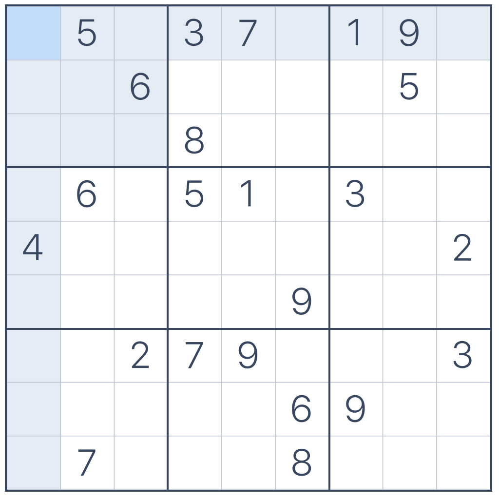
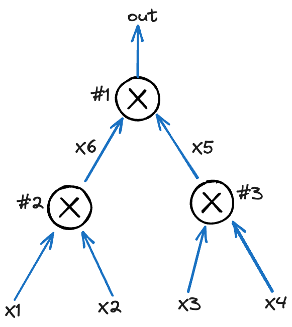

# How Halo2 works at the code level

Here I will combine the [example in the Halo2 book](https://zcash.github.io/halo2/user/simple-example.html) to introduce how Halo2 works and how to use Halo2.

If you haven't touched ZK before, don't worry, I will introduce enough background knowledge. 


It is difficult to find Plonk/Halo2 resources that avoid the extremes of either over simplyfying the subject, or presenting so much mathematical detail that the reader gets bogged down and loses interest.

The purpose of this tutorial then is to find an accessible but informative middle ground, although I can't explain all the code details, I try to divide the components as black boxes small enough.

## Start with some simple examples

**Actors**

- Prover - I will call her Alice
- Verifier - I will call him Bob

**Sudoku**

In order to establish some basic understanding, I use the example of Sudoku.

This is Sudoku problem, its answer needs to fill in the blank cell with an integer from 1-9, and satisfy that each `row`, `column` and `small table` contains 1-9.



The prover Alice says she knows the answer of a certain Sudoku, and Bob will verify it.

1. Bob generates random numbers $x, y$, that $x \in \{1, 2, 3\}$ and $y \in \{1, \dots, 9\}$, $x$ represents type in `row`, `column` and `small table`, and send to Alice.
2. For example, this time $x = 1, y = 5$, then Alice needs to provide 9 values of row_5 to Bob
3. Bob will check if the set of 9 values is equal to $\{1, \dots, 9\}$

Repeat step 1-3, And Bob rebuild Sudoku on a blank $9 \times 9$ table to check if Alice's answer is inconsistent.

As the rounds progress, Alice always passes the check. There is an increasing **probability** that Alice does have the answer. At the same time, Alice leaks more and more knowledge about the answer.

It is not **zero-knowledge** because Bob has at least part of the answer's knowledge.

This is an **interactive proof**, which has some disadvantages. It requires the prover and the verifier to be online at the same time, and the scalability is poor, because if Alice needs to prove to Dan, Eva, etc. that she knows the answer, she can only repeat the same progress.

Verifiers need to generate **random** numbers, just like verifiers in real life - market product quality inspectors. They need to **randomly** check certain products from a group of products. If the product seller decides which products to check, the seller will definitely choose products which are good.

**Equal Polynomial**

Another example concerns polynomials. 

Suppose there is a mathematical problem whose answer is a polynomial $f(x) = \sum_{i=0}^{k}c_ix^i$. Bob already knows the answer, that is, knows the polynomial, and Alice claims that she also knows the answer, whose polynomial is $g(x) = \sum_{i=0}^{k}d_ix^i$, and Alice proves this to Bob.

In the first method, Alice sends all $d_i$ to Bob. Bob checks if $d_i = c_i$, and here $k$ comparisons are required.

In the second method, 
1. Bob **randomly** selects a value $r$ from the domain of $g(x)$ and sends it to Alice.
2. Alice calculates the value of $g(r)$, and send to Bob.
3. Bob calculates the value of $f(r)$, and checks if $g(r) = f(r)$

If $g(r) = f(r)$, then the probability that Alice is lying, that is, the probability that $P_{g(x) != f(x)} \leqslant \frac{k}{|domain|}$,  where $|demain|$ represents the number of elements in the domain of $g(x), f(x)$.

Because this equation $f(x) - g(x) = \sum_{i=0}^{k}(c_i-d_i)x^i = 0$
 has at most $k$ roots. The probability that $r$ randomly selected from the domain is exactly one of the $k$ roots is $\frac{k}{|domain|}$

The length of the general domain is very large, about $2^{256}$, $k$ is [about $2^{20} \sim 2^{30}$](https://crypto.stackexchange.com/a/103416/75873), Therefore the probability of Alice lying is negligibly small。

The second method reduces the number of comparisons from $k$ to $1$. This is where the **Succinct** comes from in a sense.

And it is **zero-knowledge**, because Alice did not reveal the information of $d_i$.

We can replace the interactive steps with a non-interactive random oracle access. In practice, we can use a cryptographic hash function instead. This is why we need to [hash the message when signing](https://en.wikipedia.org/wiki/Fiat%E2%80%93Shamir_heuristic)

Through the above two examples, we have at least a basic understanding of **zk-SNARK**(Zero Knowledge Succinct Non-Interactive Argument of Knowledge).

> ... arguments are cryptographic protocols that enable an untrusted prover to provide a guarantee that it performed a requested computation corrently.


## Halo2 examples

How to prove that $2^2 \times 3^2 = 36$ ?

### PLONKish Arithmetization

**program**

```rs
fn cal(a: u64, b: u64) -> u64 {
    (a * b).pow(2)
}
```

There are many ways to convert the same program to a circuit, and different circuits will have different performances. For circuit optimization, please refer to [here](https://zips.z.cash/protocol/canopy.pdf#circuitdesign).

**circuit**



It can be seen that this circuit is composed of three multiplication gates, and satisfies three constraints:

- $x_1 \cdot x_2 =x_6$
- $x_3 \cdot x_4 = x_5$
- $x_6 \cdot x_5 = out$

We define a matrix $W\in\mathbb{F}^{n\times 3}$ to represent constraints ($n$ being the number of arithmetic gates):

$$
\begin{array}{c|c|c|c|}
\texttt{i} & w_a & w_b & w_c  \\
\hline
\texttt{1} & x_6 & x_5 & out \\
\texttt{2} & x_1 & x_2 & x_6 \\
\texttt{3} & x_3 & x_4 & x_5 \\
\end{array}
$$

The $W$ matrix can only represent the input and output values of the gates. We also need to represent the operation(Add or Mul) of the gates, We define a vector $Q\in\mathbb{F}^{n\times5}$:

$$
\begin{array}{c|c|c|c|}
\texttt{i}  & q_L & q_R & q_M & q_C & q_O  \\
\hline
\texttt{1} & 0 & 0 & 1 & 0& 1 \\
\texttt{2} & 1 & 1 & 0 & 0& 1 \\
\texttt{3} & 0 & 0 & 1 & 0& 1 \\
\end{array}
$$


### Plonkish Arithmetization


```rs
impl<F: Field> Circuit<F> for MyCircuit<F> {
    type Config = MyConfig;
    type FloorPlanner = SimpleFloorPlanner;
    fn without_witnesses(&self) -> Self {}

    // 它仅仅用于电路拓扑，和电路里面具体的值没关系
    // 返回的 Config 一般表示不同类型的列各有有多少， 它们的 column index 是多少。
    // 并且修改了约束系统。
    fn configure(meta: &mut ConstraintSystem<F>) -> Self::Config {}

    // 仅仅修改了布局器
    fn synthesize(
        &self,
        config: Self::Config,
        mut layouter: impl Layouter<F>,
    ) -> Result<(), Error> {}
}
```

## Reference
- [Halo2 book](https://zcash.github.io/halo2/index.html)
- [PLONK](https://eprint.iacr.org/2019/953)
- [Why and How zk-SNARK Works](https://arxiv.org/abs/1906.07221)
- [How does PLONK work?](https://www.youtube.com/watch?v=RUZcam_jrz0&list=PLBJMt6zV1c7Gh9Utg-Vng2V6EYVidTFCC&index=1&t=0s)
- [Understanding PLONK](https://vitalik.ca/general/2019/09/22/plonk.html)
- [理解 Plonk 协议](https://github.com/sec-bit/learning-zkp/blob/develop/plonk-intro-cn/README.md)
- [Zcash Protocol Specification](https://zips.z.cash/protocol/canopy.pdf#circuitdesign)